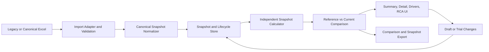

# System Architecture Specification — Cost Breakdown

> **Document status:** Draft Target Architecture for review  
> **Starting point:** The current implementation documented in `PROJECT.md`  
> **Intent:** Extend the working system incrementally. This is not a rewrite plan and does not authorize source-code changes by itself.

## 1. Overview & Problem Statement

### Current problem

The current application already calculates cost, imports Excel, shows detailed BOM/Routing views, ranks cost drivers, and supports product-session versioning. Its main structural limitation is that Reference/Base and Current/Active values are stored together in the same BOM and Routing rows.

That coupling makes it difficult to:

- preserve independent historical snapshots;
- identify whether a row was added, removed, changed, moved, or ambiguously matched;
- compare Work Center rates independently from operation runtime changes;
- show field-level source confidence without inventing values; and
- keep trials separate from approved standard data.

### Target goals

1. Preserve the current Excel-first workflow and verified calculation behavior.
2. Introduce independent Reference and Current cost snapshots.
3. Calculate each snapshot independently, then compare the results.
4. Trace differences from total cost to cost element, BOM item, Routing operation, and Work Center rate.
5. Keep Draft, Active, and Archived application lifecycle separate from Reference/Current comparison roles.
6. Make source, confidence, missing data, and matching ambiguity visible.
7. Reuse the current calculation, Excel, state, and UI foundations wherever they remain correct.

### Non-goals for this redesign

- Replacing the verified Excel model without formula-parity evidence.
- Automatic write-back from the web application to the source workbook.
- A new backend, cloud database, permissions system, or multi-site platform without separate approval.
- Inventing exact monetary attribution when multiple variables interact and the source model cannot prove it.

## 2. Architecture Topology & Component Boundaries

### Target flow



### Component responsibilities

#### 1. Excel Import Adapter

- Read the current workbook format: `1_MASTER_RATES`, `2_BOM_BREAKDOWN`, and `3_ROUTING_BREAKDOWN`.
- Accept both the current paired Base/Active layout and the future canonical snapshot layout.
- Preserve source references and workbook metadata.
- Convert missing or defaulted values into explicit confidence/warning information.
- Never silently discard rows, duplicate keys, or ambiguous matches.

#### 2. Canonical Snapshot Model

- Represent one complete cost state independently from another state.
- Store product metadata, effective date, source reference, Work Center rates, BOM rows, Routing rows, confidence, and lifecycle status.
- Keep comparison role (`reference` or `current`) separate from lifecycle status (`draft`, `active`, `archived`).

#### 3. Calculation Engine

- Calculate one snapshot at a time.
- Reuse the existing formula logic and safe guards where mathematically correct.
- Return both numeric results and calculation warnings/status.
- Never use an undocumented hard-coded rate or yield fallback.

#### 4. Comparison Engine

- Compare two independently calculated snapshots.
- Report total, material, labor, burden, BOM, Routing, and Work Center differences.
- Separate exact cost gaps from explanatory driver attribution.
- Do not double-count Work Center rate changes inside operation-level explanations.

#### 5. Lifecycle and State Store

- Allow edits only in Draft or Trial data.
- Keep Active data read-only for live calculation.
- Promote Draft to Active only through an explicit action and archive the previous Active version.
- Preserve old sessions through a versioned storage migration.

#### 6. UI and Export

- Show the workflow as Reference/Before → Current/After → Difference.
- Allow drill-down from total cost to BOM, Routing, and Work Center.
- Display confidence and matching warnings next to the affected information.
- Export snapshots and comparison results without writing back to the source Excel file.

## 3. Machine-Readable Architecture Graph

```json
{
  "name": "Cost Breakdown Target Architecture",
  "version": "0.1-draft",
  "nodes": [
    { "id": "excel-adapter", "name": "Excel Import Adapter", "type": "adapter", "boundary": "input" },
    { "id": "snapshot-model", "name": "Canonical Cost Snapshot", "type": "domain", "boundary": "core" },
    { "id": "calculator", "name": "Independent Snapshot Calculator", "type": "service", "boundary": "core" },
    { "id": "comparison", "name": "Snapshot Comparison", "type": "service", "boundary": "core" },
    { "id": "lifecycle-store", "name": "Snapshot Lifecycle Store", "type": "state", "boundary": "application" },
    { "id": "ui", "name": "Cost Breakdown UI", "type": "client", "boundary": "presentation" },
    { "id": "export", "name": "Snapshot and Comparison Export", "type": "adapter", "boundary": "output" }
  ],
  "edges": [
    { "source": "excel-adapter", "target": "snapshot-model", "protocol": "normalized-data", "payload": "validated snapshot input" },
    { "source": "snapshot-model", "target": "calculator", "protocol": "function call", "payload": "CostSnapshot" },
    { "source": "calculator", "target": "comparison", "protocol": "function call", "payload": "SnapshotCost" },
    { "source": "comparison", "target": "ui", "protocol": "state/query", "payload": "CostComparison" },
    { "source": "comparison", "target": "export", "protocol": "normalized-data", "payload": "comparison report" },
    { "source": "ui", "target": "lifecycle-store", "protocol": "state mutation", "payload": "draft or trial action" }
  ]
}
```

## 4. Data Contracts & Interfaces

The following are target contracts. Exact TypeScript names may be adjusted during implementation, but the separation is required.

### Snapshot and lifecycle concepts

```ts
type ComparisonRole = 'reference' | 'current'
type DatasetStatus = 'draft' | 'active' | 'archived'
type ConfidenceStatus = 'verified' | 'estimated' | 'missing'

interface FieldEvidence {
  status: ConfidenceStatus
  sourceRef?: string
  basis?: string
}

interface CostSnapshot {
  id: string
  product: ProductMaster
  effectiveDate: string
  sourceRef: string
  comparisonRole?: ComparisonRole
  status: DatasetStatus
  rates: SnapshotWorkCenterRate[]
  bom: SnapshotBOMItem[]
  routing: SnapshotRoutingStep[]
}
```

`comparisonRole` is optional on storage records because a snapshot may be selected as Reference or Current in more than one comparison. It must not be confused with `status`.

### Snapshot BOM row

```ts
interface SnapshotBOMItem {
  id: string
  itemCode: string
  description: string
  consumption: number | null
  unit: string
  price: number | null
  loss: number | null
  sourceRef?: string
  confidence: Record<string, FieldEvidence>
}
```

### Snapshot Routing row

```ts
interface SnapshotRoutingStep {
  id: string
  operationCode?: string
  sequence?: number
  processCode?: string
  processName: string
  workCenterId?: string
  manning: number | null
  capacity: number | null
  yield: number | null
  sourceRef?: string
  confidence: Record<string, FieldEvidence>
}
```

Routing identity must prefer a stable operation ID or process code. Sequence is an ordering attribute, not identity. Work Center is a dependency and aggregation dimension, not the sole operation identity.

### Work Center rate

```ts
interface SnapshotWorkCenterRate {
  id: string
  workCenterCode: string
  description: string
  laborRate: number | null
  burdenRate: number | null
  effectiveDate: string
  sourceRef?: string
  confidence: Record<string, FieldEvidence>
}
```

### Comparison result

```ts
type MatchStatus = 'matched' | 'added' | 'removed' | 'ambiguous' | 'unmatched'

interface ChangeFlags {
  reordered?: boolean
  movedWorkCenter?: boolean
  changedInputs?: boolean
  changedRate?: boolean
}

interface CostComparison {
  id: string
  referenceSnapshotId: string
  currentSnapshotId: string
  referenceCost: SnapshotCost
  currentCost: SnapshotCost
  totalGap: number | null
  elementGaps: Record<'material' | 'labor' | 'burden', number | null>
  bomFindings: ComparisonFinding[]
  routingFindings: ComparisonFinding[]
  workCenterFindings: ComparisonFinding[]
  warnings: ComparisonWarning[]
}

interface ComparisonFinding {
  referenceId?: string
  currentId?: string
  matchStatus: MatchStatus
  changeFlags: ChangeFlags
  fieldDiffs: Record<string, { reference: unknown; current: unknown }>
  costGap?: number | null
  confidence: ConfidenceStatus
}
```

### Matching rules

- **BOM:** match by stable material/item code; duplicate or missing codes require `ambiguous`/`unmatched` review.
- **Routing:** match by stable operation ID or process code; use normalized process name only as a controlled fallback. Do not require Work Center to match an operation because an operation may move between Work Centers.
- **Work Center:** match by Work Center code plus effective-date/rate context.
- A row can be matched while still carrying `reordered`, `movedWorkCenter`, or `changedInputs` flags.
- Ambiguous matches must remain visible and must not be silently merged.

### Calculation and attribution rules

- `calculateSnapshotCost(snapshot)` calculates one snapshot independently.
- `compareSnapshots(reference, current)` calculates exact differences after both snapshots are complete.
- Exact total and element gaps are authoritative comparison outputs.
- Driver attribution is explanatory and must not claim a unique monetary cause when variables interact.
- Work Center rate changes and Routing runtime/yield changes are reported as separate dimensions and must not be counted twice.

## 5. Migration from the Current Model

The first implementation must preserve the current workflow through an adapter.

### Current paired row → two snapshots

| Current field | Reference snapshot | Current snapshot |
| :--- | :--- | :--- |
| `BOMItem.basePrice` | `price` | — |
| `BOMItem.activePrice` | — | `price` |
| `BOMItem.baseLoss` | `loss` | — |
| `BOMItem.activeLoss` | — | `loss` |
| `RoutingStep.baseCap` | `capacity` | — |
| `RoutingStep.activeCap` | — | `capacity` |
| `RoutingStep.baseYield` | `yield` | — |
| `RoutingStep.activeYield` | — | `yield` |
| Shared `consumption`, `manning`, description, and item identity | copied | copied |

Migration requirements:

1. Load old persisted sessions with a schema version.
2. Split paired fields into Reference and Current snapshot rows.
3. Preserve existing IDs where they are stable; mark generated/index-based IDs as migration-derived.
4. Preserve `sourceRef` and attach confidence/basis to any value produced by a legacy default.
5. Keep old Excel import working through the legacy adapter.
6. Replace `promoteActiveToBaseline` with an explicit snapshot/reference action; never overwrite historical values in place.
7. Keep the migration reversible until the new comparison path has passed parity checks.

## 6. Error Handling & Resilience

- Missing or invalid input must produce a visible status, not an unlabelled zero or hidden default.
- Estimated and Missing values remain non-blocking for navigation and calculation, as required by the project rules.
- The calculation result must carry warnings or an `estimated`/`missing` status when a required input is unavailable.
- The exact policy for a missing Work Center rate or capacity is still pending and must be agreed before implementation; the current hard-coded fallback is not acceptable as a hidden behavior.
- Duplicate keys, ambiguous matches, and conflicting source rows must produce `Need Review` findings.
- Divide-by-zero and invalid numeric inputs must be handled by the existing safe-guard pattern and must not stop unrelated rows from calculating.
- Formula logic in Excel and the web engine must remain mathematically aligned.

## 7. Verification & Acceptance Criteria

### Definition of Done for the redesign foundation

- A legacy paired workbook imports into two independently inspectable snapshots.
- Reference and Current totals match the verified Excel calculation for representative models.
- Changing one snapshot does not mutate the other snapshot.
- Active data remains read-only; edits happen in Draft or Trial.
- Adding, removing, reordering, or moving a Routing operation produces the correct matching status/flags.
- Missing/Estimated inputs are visible and do not silently become verified numbers.
- Work Center rate changes are traceable and not double-counted in operation findings.
- Existing Draft/Active/Archived behavior remains intact after migration.
- The build passes and a dedicated regression check covers calculation, matching, import, and lifecycle behavior.

### Verification layers

1. Pure calculation tests against known Excel results.
2. Snapshot comparison tests for added, removed, changed, reordered, duplicate, and ambiguous rows.
3. Legacy Excel import tests and source/provenance checks.
4. State migration and Active/Draft/Archived lifecycle tests.
5. UI acceptance for Reference → Current → Difference and confidence warnings.

## 8. Phased Implementation Plan

1. **Foundation contract:** freeze the target types, terminology, identity rules, and missing-data policy.
2. **Compatibility adapter:** convert current paired sessions and legacy Excel into canonical snapshots without changing the UI.
3. **Calculation core:** calculate snapshots independently and add parity tests before replacing current screens.
4. **Comparison core:** add matching, change flags, exact gaps, Work Center diagnostics, and warnings.
5. **Lifecycle migration:** prevent active mutation, support schema migration, and preserve Draft/Active/Archived behavior.
6. **Excel validation/export:** add canonical mapping and comparison export while keeping legacy import compatibility.
7. **UI migration:** update summary, detailed tables, candidate selection, and navigation to the Reference/Current flow.
8. **Trial/RCA migration:** isolate trials and require review before promotion.
9. **Hardening:** run regression, build, data-quality, and formula-parity checks; document remaining limitations.

## 9. Open Questions Requiring Confirmation

- Should the UI labels be `Before/After` while internal contracts use `Reference/Current`?
- What is the authoritative stable identity for a Routing operation in the real Excel source?
- What exactly does MHr represent in each workbook variant?
- What should the calculation display when a required Work Center rate is Missing while calculation must remain non-blocking?
- How should rate changes across effective dates be selected and compared?
- Which workbook layout should become the canonical new import/export format after the real schema map is approved?

## 10. Next Action

Review this target architecture against the Current Baseline. After approval, create the project quality/verification constraints and implement the first compatibility-and-calculation slice. No source code should be changed until the open decisions that affect the data contract are confirmed.
