# COSTBREAKDOWN System Logic Diagram

> This document visualizes the finalized COSTBREAKDOWN system logic defined in [`docs/specs/FINAL_LOGIC_SPEC.md`](specs/FINAL_LOGIC_SPEC.md). It does not introduce new behavior and is not a separate source of truth.

## Simple text flow

```text
START
  │
  ▼
MASTER DATA
  ├─ Reference: Metadata / BOM / Work Center / Routing
  └─ Current:   Metadata / BOM / Work Center / Routing
  │
  ▼
VALIDATE EACH DATASET
  ├─ Valid enough to calculate → calculate that dataset independently
  └─ Missing / invalid required input
       └─ Mark affected result unavailable + warning (never fake 0)
  │
  ▼
CALCULATE REFERENCE AND CURRENT INDEPENDENTLY
  ├─ BOM
  │    Usage × Price × (1 + Loss) → MAT
  │
  └─ Routing + Work Center
       Routing Factor = Manning / (Capacity × Yield)
         ├─ × Labor Rate  → LB
         └─ × Burden Rate → BD
       Conversion = LB + BD
  │
  ▼
STANDARD COST = MAT + LB + BD
  │
  ▼
CBD — FULL COMPARISON (default)
  ├─ Match by business identity: BOM Name / Work Center WC / Routing Process
  ├─ Compare Reference and Current
  ├─ Status: UNCHANGED / CHANGED / ADDED / REMOVED
  └─ Gap = Current - Reference
  │
  ▼
COST BREAKDOWN / DRILL-DOWN
  ├─ Material → BOM → Usage / Price / Loss
  └─ Processing
       ├─ Work Center context → Labor Rate / Burden Rate / aggregation
       └─ Process / Routing → Manning / Capacity / Yield / WC assignment
  │
  ├─ Continue in Full Comparison → Ranking (full candidate pool)
  │
  └─ OPTIONAL SELECTED COMPARISON
       ├─ Select BOM and/or Process findings (not Work Center)
       ├─ Review Selected Gap for the active scope
       ├─ Exit Selected → return to Full Comparison
       └─ Continue → Ranking limited to Selected Scope
  │
  ▼
RANKING
  ├─ Candidates: BOM and Process / Routing
  ├─ Work Center is context, not a Candidate
  ├─ Rank by Gap; keep positive, zero, and negative Gaps visible
  ├─ Controllable is a human judgment aid, not an automatic gate
  └─ Human selects exactly ONE Candidate (no auto-selection)
  │
  ▼
RCA — ONE CANDIDATE AT A TIME
  ├─ Why did it change?
  └─ Optional Root Cause / Why? and Action notes
  │
  ▼
SIMULATION
  ├─ Baseline = Current
  ├─ Scenario A: its own local overrides
  └─ Scenario B: its own local overrides
       For either scenario, supported inputs are:
       BOM Usage / Price / Loss;
       Routing Manning / Capacity / Yield;
       Work Center Labor Rate / Burden Rate
       Recalculate each independently with the same Standard Cost engine
  │
▼
ECONOMICS + BUSINESS (for each scenario)
  ├─ Fixed Investment and Variable Added Cost per pc are independent
  ├─ Evaluation Quantity; Fixed Equivalent per pc = Fixed Investment / Quantity when used
  ├─ Add categorized economics to MAT / LB / BD once; avoid double counting
  ├─ Selling Price and SG&A % (default to Current unless overridden)
  ├─ SG&A = Selling Price × SG&A %
  └─ OP = Selling Price - Standard Cost - SG&A
  │
  ▼
COMPARE SCENARIO A VS B
  ├─ Compare MAT / LB / BD / Standard Cost / Selling Price / SG&A / OP
  ├─ Show input-change and trade-off context
  └─ Human selects ONE scenario; the system does not choose a winner
  │
  ▼
SIMULATED = HUMAN-SELECTED SCENARIO
  │
  ▼
FINAL STORY
  Reference → Current → Simulated
       Gap 1      Gap 2
  Gap 1 = Current - Reference
  Gap 2 = Simulated - Current
  Show MAT / LB / BD / Standard Cost / Selling Price / SG&A / OP
  Preserve signed values, including negative OP
  │
  ▼
OPTIONAL TRIAL HANDOFF
  │
  ▼
END
```

## Detailed flow

```mermaid
flowchart TD
    start([START]) --> master["MASTER DATA"]
    master --> refData["REFERENCE snapshot<br/>Metadata · BOM · Work Center · Routing"]
    master --> curData["CURRENT snapshot<br/>Metadata · BOM · Work Center · Routing"]

    refData --> refValidate["Validate Reference dataset"]
    curData --> curValidate["Validate Current dataset"]
    refValidate -->|valid enough to calculate| refCalc["Calculate Reference independently"]
    refValidate -->|required input missing or invalid| refUnavailable["Mark affected Reference result unavailable<br/>Show warning; never fake 0"]
    curValidate -->|valid enough to calculate| curCalc["Calculate Current independently"]
    curValidate -->|required input missing or invalid| curUnavailable["Mark affected Current result unavailable<br/>Show warning; never fake 0"]

    refCalc --> refResult["Reference result<br/>MAT · LB · BD · Standard Cost"]
    refUnavailable --> refResult
    curCalc --> curResult["Current result<br/>MAT · LB · BD · Standard Cost"]
    curUnavailable --> curResult

    costEngine["STANDARD COST ENGINE — invoked separately per snapshot<br/>MAT = Σ(Usage × Price × (1 + Loss))<br/>Routing Factor = Manning ÷ (Capacity × Yield)<br/>LB = Routing Factor × Labor Rate<br/>BD = Routing Factor × Burden Rate<br/>Conversion = LB + BD<br/>Standard Cost = MAT + LB + BD"]
    costEngine -.-> refCalc
    costEngine -.-> curCalc

    refResult --> cbd["CBD — FULL COMPARISON (default)<br/>Match by business identity: BOM = Name · Work Center = WC · Routing = Process<br/>Status: UNCHANGED · CHANGED · ADDED · REMOVED<br/>Gap = Current − Reference"]
    curResult --> cbd

    cbd --> drill["COST BREAKDOWN / DRILL-DOWN"]
    drill --> material["Material → BOM<br/>Status · Reference / Current cost · Gap<br/>Usage · Price · Loss explain changed inputs"]
    drill --> processing["Processing"]
    processing --> workCenter["Work Center context<br/>Labor Rate · Burden Rate<br/>Rate owner and aggregation context"]
    processing --> process["Process / Routing<br/>Manning · Capacity · Yield · WC assignment"]
    workCenter --> wcAggregation["Aggregate processing totals by Work Center<br/>1:1 Routing match is not required"]
    process --> wcAggregation

    drill --> selectedChoice{"Enter optional Selected Comparison?"}
    selectedChoice -->|No — continue with full scope| fullRanking["Full Candidate Pool"]
    selectedChoice -->|Yes| selected["SELECTED COMPARISON<br/>Select BOM and/or Process findings; not Work Center<br/>Matched pairs move together; ADDED/REMOVED are selected independently<br/>Selected Gap = active selected scope"]
    selected --> selectedExit{"Exit Selected or continue?"}
    selectedExit -->|Exit Selected| cbd
    selectedExit -->|Continue to Ranking| scopedRanking["Candidate Pool limited to Selected Scope"]

    fullRanking --> ranking["RANKING<br/>Candidates: BOM and Process / Routing; statuses CHANGED / ADDED / REMOVED<br/>Work Center is context, never a Candidate<br/>Gap descending; positive, zero, and negative Gaps remain visible<br/>Controllable = true by default; human judgment aid, not an automatic gate"]
    scopedRanking --> ranking
    ranking --> chooseCandidate["HUMAN SELECTS EXACTLY ONE CANDIDATE<br/>No automatic selection"]
    chooseCandidate --> rca["RCA — one Candidate at a time<br/>Why did it change?<br/>Optional Root Cause / Why? and Action notes"]

    rca --> simulation["SIMULATION<br/>Baseline = Current<br/>Exactly two independent scenarios; source snapshots stay unchanged"]
    simulation --> scenarioA["SCENARIO A<br/>Scenario-local overrides"]
    simulation --> scenarioB["SCENARIO B<br/>Scenario-local overrides"]
    supportedInputs["Supported overrides<br/>BOM: Usage · Price · Loss<br/>Routing: Manning · Capacity · Yield<br/>Work Center: Labor Rate · Burden Rate<br/>No structural changes"]
    supportedInputs -.-> scenarioA
    supportedInputs -.-> scenarioB

    scenarioA --> recalcA["Recalculate with the same Standard Cost engine"]
    scenarioB --> recalcB["Recalculate with the same Standard Cost engine"]
    recalcA --> economicsA["ECONOMICS + BUSINESS — Scenario A"]
    recalcB --> economicsB["ECONOMICS + BUSINESS — Scenario B"]
    econRules["Per scenario: Fixed Investment and Variable Added Cost / pc are independent; Evaluation Quantity<br/>Fixed Equivalent / pc = Fixed Investment ÷ Evaluation Quantity when used; quantity must be positive<br/>Add categorized economics once to MAT / LB / BD; avoid double counting<br/>Simulated Standard Cost = MAT + LB + BD<br/>Selling Price and SG&A % default to Current unless overridden<br/>SG&A = Selling Price × SG&A % · OP = Selling Price − Standard Cost − SG&A"]
    econRules -.-> economicsA
    econRules -.-> economicsB
    economicsA --> outcomeA["Scenario A money outcome<br/>Simulated MAT / LB / BD; Standard Cost; Selling Price; SG&A; OP"]
    economicsB --> outcomeB["Scenario B money outcome<br/>Simulated MAT / LB / BD; Standard Cost; Selling Price; SG&A; OP"]

    outcomeA --> compareScenarios["COMPARE SCENARIO A VS B<br/>Per-piece money outcomes: MAT · LB · BD · Standard Cost · SG&A · OP · Selling Price<br/>Show input-change / trade-off context"]
    outcomeB --> compareScenarios
    compareScenarios --> chooseScenario["HUMAN SELECTS ONE SCENARIO<br/>The system does not choose a winner"]
    chooseScenario --> simulated["SIMULATED = human-selected scenario"]
    simulated --> finalStory["FINAL STORY<br/>REFERENCE → CURRENT → SIMULATED<br/>Gap 1 = Current − Reference · Gap 2 = Simulated − Current<br/>For all three states: MAT · LB · BD · Standard Cost · Selling Price · SG&A · OP<br/>Preserve signed values, including negative OP"]
    finalStory --> trialChoice{"Optional Trial handoff?"}
    trialChoice -->|Yes| trial["Hand off the human-selected scenario<br/>Trial execution logic is not defined here"]
    trialChoice -->|No| finish([END])
    trial --> finish
```



## Interpretation rules

- Match records by business identity only: BOM `Name`, Work Center `WC`, and Routing `Process`. Row order is not identity. Comparison `Status` and `Gap` are independent; `CHANGED` may have a zero Gap. An absent side for `ADDED` or `REMOVED` contributes zero, while missing or invalid required input remains unavailable. Changed BOM inputs explain the record Gap; no per-input monetary attribution is defined.
- Work Center owns Labor and Burden rates and provides calculation/aggregation context. The Candidate is the BOM or Process / Routing finding, not the Work Center.
- Selected Comparison is temporary, may narrow Ranking, and ends when one Candidate enters RCA. A Reference or Current source change invalidates the scope. Simulation then uses the normal full Current baseline.
- Scenario A and B are independent. The user chooses the scenario that becomes `Simulated`; Trial may receive that selection, while Trial execution and approval behavior remain outside this specification.

## Final Logic source map

The line ranges below point to the authoritative detail behind both diagrams; edge cases and full wording remain in the source specification.

| Diagram area | Final Logic source |
| --- | --- |
| End-to-end flow and Trial boundary | [`FINAL_LOGIC_SPEC.md` §1, L73–L119](specs/FINAL_LOGIC_SPEC.md#L73-L119) |
| Snapshots, identity, statuses, formulas, unavailable inputs | [`FINAL_LOGIC_SPEC.md` §2, L120–L359](specs/FINAL_LOGIC_SPEC.md#L120-L359) |
| Master Data and validation | [`FINAL_LOGIC_SPEC.md` §3, L360–L567](specs/FINAL_LOGIC_SPEC.md#L360-L567) |
| CBD drill-down, aggregation, and warnings | [`FINAL_LOGIC_SPEC.md` §4, L568–L801](specs/FINAL_LOGIC_SPEC.md#L568-L801) |
| Selected Comparison, Ranking, and RCA | [`FINAL_LOGIC_SPEC.md` §§5–7, L802–L1141](specs/FINAL_LOGIC_SPEC.md#L802-L1141) |
| Simulation, Economics, Business, and A/B comparison | [`FINAL_LOGIC_SPEC.md` §§8–11, L1142–L1655](specs/FINAL_LOGIC_SPEC.md#L1142-L1655) |
| Final Story and cross-page state boundaries | [`FINAL_LOGIC_SPEC.md` §§12 and 15, L1656–L1783 and L2366–L2430](specs/FINAL_LOGIC_SPEC.md#L1656-L1783) · [`§15, L2366–L2430`](specs/FINAL_LOGIC_SPEC.md#L2366-L2430) |
