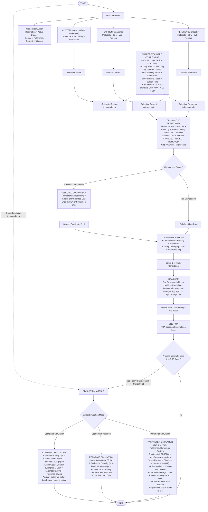

# COSTBREAKDOWN System Logic Diagram

> This document visualizes the finalized COSTBREAKDOWN system logic defined in [`docs/specs/FINAL_LOGIC_SPEC.md`](specs/FINAL_LOGIC_SPEC.md). It does not introduce new behavior and is not a separate source of truth.

## Simple text flow

```text
START
  │
  ▼
MASTER DATA
  ├─ Reference: Metadata / BOM / Work Center / Routing
  ├─ Current:   Metadata / BOM / Work Center / Routing
  └─ Custom:    Metadata / BOM / Work Center / Routing
       (Free workspace: structural changes, sizing, alternatives, trial data)
  │
  ├─ Clone From: Destination = Active dataset; Source = chosen dataset
  │
  ▼
VALIDATE & CALCULATE DATASETS INDEPENDENTLY
  ├─ Valid inputs → calculate using shared Standard Cost engine
  └─ Missing/invalid inputs → mark affected results unavailable (never substitute 0)
  │
  ▼
STANDARD COST ENGINE (Shared)
  ├─ MAT = Σ(Usage × Price × (1 + Loss))
  ├─ Routing Factor = Manning / (Capacity × Yield)
  ├─ LB = Routing Factor × Labor Rate
  ├─ BD = Routing Factor × Burden Rate
  ├─ Conversion = LB + BD
  └─ Standard Cost = MAT + LB + BD = MAT + Conversion
  │
  ▼
CBD — COST BREAKDOWN (Reference vs Current only)
  ├─ Match by business identity: BOM Name / WC / Process
  ├─ Comparison statuses: UNCHANGED / CHANGED / ADDED / REMOVED
  ├─ Gap = Current - Reference
  │
  ├─ Mode A: Full Comparison (default)
  └─ Mode B: Selected Comparison (temporary analysis scope; shows selected Gap only)
  │
  ▼
CANDIDATE PRIORITIZATION / RANKING
  ├─ Candidate pool from Full or Selected scope
  ├─ Candidates: BOM (material records) and Process / Routing (processing records)
  ├─ Work Center is calculation/rate context, never a Candidate
  ├─ Gap descending (highest to lowest; advisory ranking; no auto-selection)
  └─ Controllable flag (human judgment, default true)
  │
  ▼
RCA CASE — SELECT 1 OR MANY CANDIDATES
  ├─ Select 1 or Multiple Candidates into one RCA Case
  ├─ Root Cause / Why? (Case-level operational diagnosis)
  ├─ Action (Case-level countermeasure)
  └─ END RCA (RCA legitimately completes here)
  │
────────────────── OPTIONAL ──────────────────
  │
  ▼
SIMULATION MODULE (Two Interoperable Dimensions)
  (May also be opened directly without an RCA Case)
  │
  ├─────────────────────────────┬─────────────────────────────┐
  ▼                             ▼                             ▼
PARAMETER ONLY                ECONOMIC ONLY                 COMBINED
  │                             │                             │
  ├─ Start SIM From:            ├─ Action Cost (THB)          ├─ Both dimensions
  │    Reference, Current,      ├─ Evaluation Quantity (pcs)  │    executed
  │    or Custom                └─ Required Saving / pc =     │
  ├─ Structure locked (no adds/      Action Cost / Quantity   ├─ Parameter Saving =
  │    deletions/resizing)                                    │    Current STD - SIM STD
  ├─ Current vs SIM comparison                                ├─ Required Saving =
  │    CHANGED/UNCHANGED/ADDED:                               │    Action Cost / Qty
  │      visible & editable                                   │
  │    REMOVED:                                               └─ Economic Margin =
  │      visible, NOT editable                                     Parameter Saving -
  ├─ Select Factors to Simulate                                    Required Saving
  │    (editing visibility only)                                   (Advisory; not an
  ├─ Live full-dataset recalculate                                 approval gate)
  ├─ BOM: Price, Usage, Loss
  ├─ Routing: Manning, Cap, Yield
  └─ WC Rates: NOT SIM-editable
```

## Detailed Flow



## Key Architectural Principles

1. **Master Data Workspaces & Structural Ownership:** Master Data manages `Reference`, `Current`, and `Custom`. All structural additions, deletions, and sizing changes occur in Master Data / Custom. Datasets copy via `Clone From`.
2. **CBD Scope:** Cost Breakdown compares `Reference` vs `Current` only. `Custom` is never compared directly in CBD.
3. **Selected Comparison Boundary:** Selected Comparison shapes the Candidate pool only. It ends when an RCA Case workspace or Simulation opens; downstream flows may retain origin context but never an active scope.
4. **Multi-Candidate RCA:** One RCA Case supports one or multiple Candidates to account for complex multi-row engineering changes. RCA completes upon recording Root Cause and Action.
5. **Simulation Independence & Two Dimensions:** Simulation is an optional sandbox with Parameter Simulation (what-if cost calculation) and Economic Simulation (break-even feasibility).
6. **SIM Comparison & Editability:** Parameter Simulation compares `Current vs SIM`. `CHANGED`, `UNCHANGED`, and `ADDED` records are editable; `REMOVED` records remain visible but non-editable.
7. **Economic Separation:** Economic Action Cost is never folded into MAT, LB, BD, or Standard Cost.
