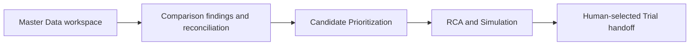

# Historical Implementation Plan: Master Data Refresh and Selected Comparison

> Operational history only. Canonical product requirements are under `docs/specs/`; per-topic status and evidence live only in `source-crosswalk-80.md`. Do not treat this plan or its unchecked items as product requirements or authorization for new feature work.

## Revision and scope

This plan preserves the implementation sequence recorded on 2026-10-05. It is not the current requirements source or active work authorization. Apply `docs/REQUIREMENTS_INDEX.md` and the canonical specs; use the crosswalk for implementation and verification status. Earlier agreement plans below remain historical.

The goal is to align the source with the confirmed Master Data workflow and Selected Comparison behavior while preserving the existing Standard Cost calculation contract. The supplied screenshot is the target layout direction for the full Master Data page; the BOM table shown is one example, not the only table the page should support. The task-level plan and verification details are in `tasks/todo.md`; the single per-topic source/status ledger is `tasks/source-crosswalk-80.md`; `HANDOFF.md` records the current checkpoint and resume point.

## Baseline and decisions

- The branch name does not constrain the work. Continue from the active COSTBREAKDOWN workspace and preserve its existing user changes.
- The implementation branch history included `codex/uiux-refresh`. This note is historical; use the authority order and canonical specs for behavior.
- Use the supplied screenshot as the target layout direction for the complete Master Data page: app navigation/status, dataset and action toolbar, product summary, and table workspace. The visible BOM table and its sample values/columns are illustrative; support Work Centers, BOM, Routing, and an All Tables view using the approved schema.
- Use compatible `uiux-refresh` patterns where helpful, without making that branch the required implementation baseline or allowing older columns to override the newer schema.
- Keep Reference and Current datasets independent. Each gets one in-session Working state and one Last Saved state; nothing persists across an application restart.
- This plan recorded `Gap = Current - Reference`; that sign convention is now `PENDING/TBD` in the canonical spec until confirmed against the original source conversation. Do not promote the code or this historical plan to authority.
- Excel templates and exports contain four data sheets (`META`, `BOM`, `ROUTING`, `WORK_CENTER`) and a separate formula-linked `COST_CALCULATION` view; import reads only the four data sheets.
- Compare BOM by Name, WC by WC, and Routing by Process. Preserve validation warnings for missing or duplicate identities; never guess matches from row position.
- Selected Comparison is temporary analysis state. It selects BOM and Routing only, retains the full WC dataset as calculation context, flows to downstream analysis, and clears when source data changes. In this mode, show only the selected-scope Gap; never show the Full Gap alongside it.
- Keep formula definitions and detailed dashboard metrics that the sources mark unresolved out of implementation scope.

### Follow-up source and implementation audit — 2026-10-05

- The later shared-chat checklist covers 80 topics, but it mixes verified baseline, finalized decisions, design directions, and pending items; it is not an 80-feature implementation backlog.
- Master Data behavior/data is closed. Candidate and RCA/Simulation redesign, the business dashboard, accounting formulas, and Trial remain future review work.
- The item-by-item crosswalk is in `tasks/source-crosswalk-80.md`. It found four context-document traceability gaps to preserve without inventing requirements: the explicit KEEP/CHANGE/REMOVE/ADD/UNDECIDED review labels; details from the dashboard reference; the provisional (not finalized) Selected Comparison control examples; and the explicit status that Candidate/RCA pages have not been re-reviewed. Figma optionality/sketch acceptability is also recorded as a smaller partial detail.
- The checklist called Full-vs-Selected Gap presentation pending at that point. The user's later explicit decision is controlling: Selected mode displays only the selected-scope Gap. The context file's pending wording is historical and is not an open product question.
- The source-to-code re-audit found and corrected an over-restriction: Clone was disabled until the source side was marked prepared, although the source defines Clone as a Working-state copy and says warnings should block only impossible operations. Both directions are now callable, and the destination inherits the source readiness flag. Final browser replay remains open.
- The same audit found that legacy Routing `Operation Code` and `Sequence` could mark a Work Center processing finding changed despite not belonging to the approved schema. They are now excluded from that signature; the regression case in `verify_comparison_reconciliation.ts` passed the final focused check.
- The workbook, Routing-identity, and Candidate verifiers are aligned to the current Product/BOM/WC/Routing contract. The neutral-workbook verifier, workbook round trip, Sizing/Clone verifier, and production build all passed at this checkpoint.
- The parser's `Selling Price (THB)` alias is covered by the workbook round trip. Templates and exports now have the four agreed data sheets plus a distinct linked calculation view. Synthetic Excel recalculation confirmed the expected sample cost and unavailable states for missing or duplicate inputs, with zero formula errors.
- Browser-only reset/import/export/clone/download and visible-status interactions remain recorded in the crosswalk; the local browser inspection was refused by the security policy and was not retried through another surface.

## Ordered implementation plan

1. **Domain and workbook contract.** Align Product, BOM, WC, and Routing types with the approved fields. Update snapshot conversion, import, template, and export together so a round trip preserves the four data sheets; keep the formula-linked calculation view separate and excluded from imports.
2. **Working / Last Saved lifecycle.** Add independent per-side states and implement Save, Reset, Import-to-Working, Clear-Working, Clone-to-current-side-Working, and Export-from-Last-Saved. Keep the state in the current runtime only.
3. **Sizing and metadata flow.** Replace Setup with Sizing; synchronize its metadata with the selected dataset; support row counts and template download from Sizing. Represent Selling Price and SG&A without applying undecided formulas.
4. **Master Data layout and tables.** Rebuild the page around the screenshot's overall hierarchy: navigation/status, dataset/action toolbar, product summary, then the table workspace. Include table selection for Work Centers, BOM, Routing, and All Tables; the screenshot's BOM is one example, not a BOM-only requirement. Implement approved schemas and identities, non-blocking validation including Routing-to-WC references, keep warning prose outside the tables, keep `#` at the left, place the reorder handle in the rightmost column, and use Search as the only table query control.
5. **Spreadsheet editing.** Add direct cell editing, keyboard navigation, copy/paste and range selection, practical undo/redo, same-column bulk edits, and selected-row add/delete. Keep drag handles dedicated to reorder only.
6. **Selected Comparison end to end.** Store the temporary scope in app memory so it survives page navigation but not restart. Let users select paired CHANGED/UNCHANGED BOM and Routing findings and independent ADDED/REMOVED findings. Recalculate from the selected BOM/Routing rows plus all WC rates; feed that result to Cost Breakdown and downstream analysis. Source changes or cancellation return to Full Comparison and clear selection without mutating either dataset.
7. **Cost Breakdown presentation.** Apply the agreed executive-first, result → cause → detail direction, using compatible `uiux-refresh` patterns. In Selected mode, every displayed summary and detail must use the selected result; WC remains calculation context and must not expose a misleading full-scope Gap. Keep detailed warnings collapsed behind a concise count and remove redundant alert copy.
8. **Integration checkpoint and review.** Run relevant existing focused verifiers and the documented production build after the connected slices, manually review the complete Master Data → Cost Breakdown → Candidate/RCA flow, and present the result for user review. Do not add a new test framework just for this work.

## Checkpoints

- After steps 1–3: build is coherent; both sides' Working/Last Saved, Sizing, and workbook actions follow the lifecycle.
- After steps 4–5: the new tables and spreadsheet editing behave according to the spec, and the comparison identities match the approved fields.
- After steps 6–7: selected scope survives downstream navigation, invalidates on source edits, and no Full Gap leaks into Selected mode.
- Final: production build succeeds and the user can review the complete workflow. Human acceptance remains separate from build success.

## Deferred decisions

- GP, COGS, OP, margin, Sales and SG&A monetary calculations.
- MatVAR/LBVAR/BDVAR definitions and the final chart composition. The interactive business graph, live scenario updates, and result-to-cause drilldown are confirmed future behavior; implementation waits for the formula and UX decisions identified in the source documents.
- Any Trial workflow rules not already settled in the source documents.

## Risks and handling

| Risk | Handling |
|---|---|
| Existing legacy fields are referenced across calculations, migrations, and exports. | Migrate the active data path in dependency order; retire compatibility code only after all references are accounted for. |
| Selected scope can be mistaken for deleting excluded rows. | Keep the source datasets unchanged; derive a temporary analysis pair and preserve all WC rates. |
| Full Gap leaks through one of several summary/table surfaces. | Route every selected-mode surface through the selected comparison result and review WC context surfaces explicitly. |
| Pending financial definitions are tempting to infer from labels. | Store and display confirmed metadata only; stop before calculating unapproved business metrics. |

---

# Historical Plan: Current Cost Breakdown Agreement

## Overview

Bring the current application into line with the four authoritative documents in `agreements/`. The implementation follows the agreed data flow: temporary Reference/Current working datasets → reconciled Comparison findings → Candidate Prioritization → RCA & Simulation → human-selected Trial handoff. The code audit and its evidence are in `.planning/2569-09-24-agreement-gap-audit/findings.md`.

## Architecture Decisions

- Keep Reference and Current as independent, browser-session Working Datasets. Manual edits, imports, comparison, and optional per-side exports use the same normalized data model.
- Make one Comparison result the source of truth for identity validation, four statuses, field differences, record cost effects, and reconciliation. UI tables, exports, and Candidate Prioritization consume those findings.
- Keep Candidate Prioritization limited to status, Reference/Current costs, Gap, Work Center aggregation, ranking, and the human Controllable mark.
- Run scenario overrides through the verified Standard Cost engine. Keep improvement economics separate from Standard Cost.
- Do not implement Trial validation/promotion or future financial metrics until separately specified.

## Dependency Flow

## Task List

The ordered implementation tasks, acceptance criteria, verification steps, dependencies, likely files, and scope estimates are tracked in [`tasks/todo.md`](todo.md). Complete each phase checkpoint before starting the next dependent phase.

## Verification Convention

- `npm run build` is the repository's documented build command.
- `package.json` does not define a test script. The repository has focused `scripts/verify_*.ts` checks, but this audit did not establish their runner command. Confirm the existing runner at the first implementation checkpoint; do not add a new test framework just to execute them.
- Add or update a focused verifier for each behavior slice, then run the focused verification and build at phase checkpoints. Use synthetic snapshots/workbooks and a browser workflow for the end-to-end check.
- Record automated evidence separately from human acceptance. No tests or build were run during the audit/planning task.

## Risks and Mitigations

| Risk | Impact | Mitigation |
|------|--------|------------|
| Routing rows lack a stable, unique business key. | Wrong pairings create misleading status and cost effects. | Use agreed operation/process identity; surface missing or duplicate keys as validation warnings. Never fall back to sequence or row order. |
| Added/removed records and missing required values are conflated. | Cost gaps become understated or falsely precise. | Treat an absent record side as zero; leave missing required values unavailable and report them separately. Reconcile detail to totals. |
| Legacy Product-session and Base/Active state is shared across pages. | Removing the old flow can break otherwise reused calculations. | Migrate the active path in dependency order and check references before retiring any shared code. |
| Trial implementation is more detailed than the agreement. | Building it would invent business rules. | Stop at a human-selected handoff; leave measured-cost validation and baseline promotion out of scope. |
| No standard test script is declared. | Focused checks may be run inconsistently. | Identify the existing runner before the first implementation slice; keep `npm run build` as the known build gate. |

## Open Questions

- When both Operation Code and Process Code are missing or non-unique, which additional stable Routing business key, if any, should the user provide? Until decided, warn and do not guess.
- The agreement defers detailed template field-selection rules. Keep the current core data model and do not invent extra template configuration.
- Trial validation, evidence capture, and baseline-promotion behavior require a separate agreement.
- Additional financial metrics remain future scope.

## Human Acceptance Boundary

The four agreements define the target behavior. Each phase still needs implementation verification, followed by explicit human review of the resulting workflow; automated `PASS` output alone is not human acceptance.
