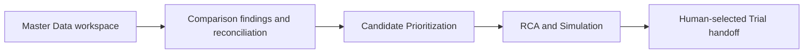

# Implementation Plan: Current Cost Breakdown Agreement

## Overview

Bring the current application into line with the four authoritative documents in `agreements/`. The implementation follows the agreed data flow: temporary Reference/Current working datasets → reconciled Comparison findings → Candidate Prioritization → RCA & Simulation → human-selected Trial handoff. The code audit and its evidence are in `.planning/2569-09-24-agreement-gap-audit/findings.md`.

## Architecture Decisions

- Keep Reference and Current as independent, browser-session Working Datasets. Manual edits, imports, comparison, and optional per-side exports use the same normalized data model.
- Make one Comparison result the source of truth for identity validation, four statuses, field differences, record cost effects, and reconciliation. UI tables, exports, and Candidate Prioritization consume those findings.
- Keep Candidate Prioritization limited to status, Reference/Current costs, Gap, Work Center aggregation, ranking, and the human Controllable mark.
- Run scenario overrides through the verified Standard Cost engine. Keep improvement economics separate from Standard Cost.
- Do not implement Trial validation/promotion or future financial metrics until separately specified.

## Dependency Flow

## Task List

The ordered implementation tasks, acceptance criteria, verification steps, dependencies, likely files, and scope estimates are tracked in [`tasks/todo.md`](todo.md). Complete each phase checkpoint before starting the next dependent phase.

## Verification Convention

- `npm run build` is the repository's documented build command.
- `package.json` does not define a test script. The repository has focused `scripts/verify_*.ts` checks, but this audit did not establish their runner command. Confirm the existing runner at the first implementation checkpoint; do not add a new test framework just to execute them.
- Add or update a focused verifier for each behavior slice, then run the focused verification and build at phase checkpoints. Use synthetic snapshots/workbooks and a browser workflow for the end-to-end check.
- Record automated evidence separately from human acceptance. No tests or build were run during the audit/planning task.

## Risks and Mitigations

| Risk | Impact | Mitigation |
|------|--------|------------|
| Routing rows lack a stable, unique business key. | Wrong pairings create misleading status and cost effects. | Use agreed operation/process identity; surface missing or duplicate keys as validation warnings. Never fall back to sequence or row order. |
| Added/removed records and missing required values are conflated. | Cost gaps become understated or falsely precise. | Treat an absent record side as zero; leave missing required values unavailable and report them separately. Reconcile detail to totals. |
| Legacy Product-session and Base/Active state is shared across pages. | Removing the old flow can break otherwise reused calculations. | Migrate the active path in dependency order and check references before retiring any shared code. |
| Trial implementation is more detailed than the agreement. | Building it would invent business rules. | Stop at a human-selected handoff; leave measured-cost validation and baseline promotion out of scope. |
| No standard test script is declared. | Focused checks may be run inconsistently. | Identify the existing runner before the first implementation slice; keep `npm run build` as the known build gate. |

## Open Questions

- When both Operation Code and Process Code are missing or non-unique, which additional stable Routing business key, if any, should the user provide? Until decided, warn and do not guess.
- The agreement defers detailed template field-selection rules. Keep the current core data model and do not invent extra template configuration.
- Trial validation, evidence capture, and baseline-promotion behavior require a separate agreement.
- Additional financial metrics remain future scope.

## Human Acceptance Boundary

The four agreements define the target behavior. Each phase still needs implementation verification, followed by explicit human review of the resulting workflow; automated `PASS` output alone is not human acceptance.
